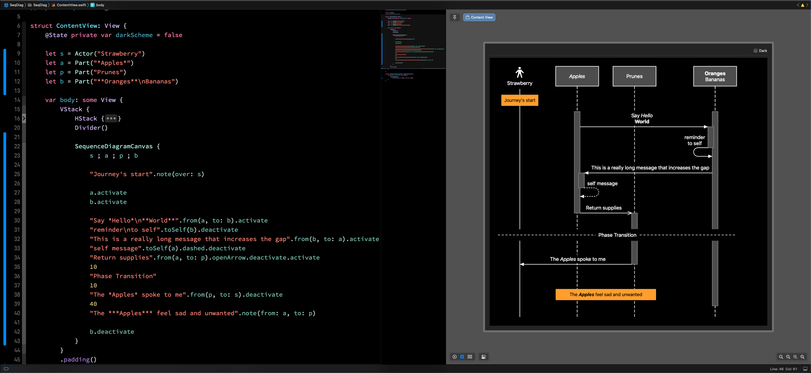

### Hi there 👋

I am currently working on adding diagrams to Swift documentation and 
hoping to connect with anyone else working on similar ideas.

The main project is [swift-sequence-diagrams](https://github.com/nickmain/swift-sequence-diagrams) - which
provides a way to create sequence diagrams using a Swift DSL and allows previewing them in Xcode.

